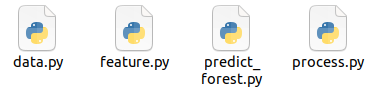

<!-- _class: cover_a -->
<!-- _header: "" --> 
<!-- _footer: "" --> 
<!-- _paginate: "" --> 

# 大数据实践：纽约地铁地铁人流量预测

###### 面向特色化领域的实践1-大数据软件课设

赵羿弦、王皓、贺佳明、菅佳玥
2024 年 12 月 17 日

## 目录 Content

<!-- _class: cols2_ol_ci fglass toc_a  -->
<!-- _footer: "" -->
<!-- _header: "CONTENTS" -->
<!-- _paginate: "" -->

- [效果演示](#3)
- [业务介绍](#10) 
- [架构设计](#16)
- [数据来源](#20)
- [实现细节](#38)

## 1. 效果演示

<!-- _class: trans -->
<!-- _footer: "" -->
<!-- _paginate: "" -->

## 2. 业务介绍

主要工作：

1. 为站点建立主要以时间周期为参数的出入人数（吞吐量）预测模型；
2. 实现历史 OD 每小时、每日、若干小时、若干天统计；
3. 实现线路拥挤度预测模型。

业务价值：

1. 对交通研究者：分析 OD 历史统计数据；
2. 对交通研究者：根据预测的站点吞吐量、线路拥挤度执行相应调度策略；
3. 对公众：提供站点吞吐量、线路拥挤度预测信息查询。

## 3. 架构设计

## 4. 数据来源与初步预处理方向

<!-- _class: trans -->
<!-- _footer: "" -->
<!-- _paginate: "" -->

### 4.1 数据来源与字段说明

纽约地铁来源-目标数据：

- Timestamp: 时间戳
- OriginStationId: 来源站点 ID
- DestinationStationId：目标站点 ID
- Ridership: 乘客人数

站点与线路所属关系数据：

- StationId：站点 ID
- StationName：站点名称
- Routes：途经线路

GTFS 数据：

- 辅助构建线路图，字段详见 GTFS 标准。

### 4.2 数据初步预处理：两种方向

- 站点视角：
  - 按站点、出入站、时间戳（精确到小时）聚合：站点预测数据源
  - 拆分时间戳：利用日期的周期性
  - 添加星期几（Day In Week）、是否为假期字段，进一步挖掘数据潜在的周期性

- 路线视角：
  - 在换手点拆分带有换乘的来源-目标数据；
  - 将来源-目标数据平摊到可能的多条线路上；
  - 按时间戳（精确到小时）、线路、来源-目标对聚合：线路拥挤度预测数据源

## 5. 实现细节：站点人流量预测

<!-- _class: trans -->
<!-- _footer: "" -->
<!-- _paginate: "" -->
### 5.1. 站点人流量预测

采用随机森林回归器实现对地铁系统各个站点的人流量预测：

- 每站点建模，请求时按需加载站点模型
- 模型特征：

  - 年、月、日、星期、是否节假日、小时、出/入站

- 模型标签：

  - 出站人数、入站人数

### 5.2. 参数调节与优化

随机选取 10 站，使用参数组分别计算对应模型的 RMSE（站点间取均值）：

|树数目\最大深度|5|10|15|20|25|
|---|---|---|---|---|---|
|10|32.318|26.305|**23.377**|23.802|23.796|
|20|34.594|25.908|25.182|25.034|25.022|
|30|30.257|24.985|25.875|26.066|26.109|
|40|31.432|24.922|23.546|23.802|23.811|
|50|31.586|25.325|25.123|25.399|25.4|

在 $树数目 = 10 且深度 = 15$ 时效果较为良好。

## 6. 实现细节：OD数据预处理与统计

<!-- _class: trans -->
<!-- _fooater: "" -->
<!-- _paginate: "" -->

## 6.1 构建纽约地铁图结构

#### 6.1.1 构建图结构的原因

- **问题**：**希望从现有的OD数据中提取更多信息**，如乘车路径、经过的线路和换乘情况。  
- **解决方案**：基于现有信息，**构建纽约地铁的图结构**，并**使用最短路径算法估计乘客的乘车路径**。

## 6.1.2 已有数据集

<!-- _class: cols-2 -->  

  

- `MTA_Subway_Stations.csv`
  - 纽约所有**站点的详细信息**，包括其站点名，id，服务的线路集合，经纬度等。

- `Subway_Lines.geojson`
  - 纽约所有**地铁线路的轨迹信息**。

## 6.1.3 数据集初步处理

<!-- _class: cols-2 -->  

  

- 美中不足的是，**纽约地铁的轨迹数据集中没有标注站点**。由于轨迹数据集的不完美性，我们也**无法将站点直接标注到轨迹中**。所以我们准备**自行建立纽约地铁图结构**。

- 在检查数据集时，**发现了一条特殊的线路：S线。**

> 纽约地铁的**S线**（Shuttle）是接驳线，方便乘客换乘。共有三条路线：**42街接驳线**（连接时报广场与大中央车站）、**富兰克林大道接驳线**（位于布鲁克林，连接富兰克林大道站与展望公园站）和**洛克威公园接驳线**（位于皇后区，连接宽水道站与洛克威公园-海滩116街站）。

- 为了方便之后的处理，我们**将其分割为三条线路**。

## 6.1.4 图构建方法

<!-- _class: pin-3-change1 -->

- 将每条线路的**站点经纬度标注在图上**，手动标注起终点，并**将其转化为旅行商问题（TSP）**。我们使用谷歌开源的`OR-Tools`求解，**大多数线路可直接得到正确的连线方式，少数形状特殊的线路只需对图结构稍作调整**。

- 例如，对于1号线，在图中标注所有点：

- 使用`OR-Tools`计算出的路径为：

## 6.1.4 图构建方法

<!-- _class: cols-3 -->

- 真实的5号线地铁线路图：

- 由`OR-Tools`初步处理后：

- 按照真实路线图，手动调整原图的部分边，将图结构调整为真实路线的结构：

## 6.1.4 图构建方法

- 在构建每条地铁线路的图结构后，将其**合并为完整的纽约地铁图结构**。**节点之间的边权重为两站点间的直线距离**，计算方式采用 Haversine 公式。

## 6.2 数据预处理与OD数据的统计分析

<!-- _class: cols-2 -->  

  

#### 6.2.1 按换乘拆分OD数据

- 输入：原始的OD数据。
- 输出：无换乘记录的，按小时聚合的OD数据。

 

- 原始的OD数据可能包含换乘，涉及多条线路，难以直接分析，我们可以将**一条有换乘数据拆成多条无换乘的数据**。

## 6.2.1 按换乘拆分OD数据

<!-- _class: cols-2-change1 -->  

  

**换乘检测算法**

1. **核心思想**：**逆向遍历站点序列，若某站点的可能线路集合为空，则标记为换乘点，并将其可能线路集合重置为当前边的线路集合。**

2. **计算步骤**：  
   - 初始可能线路集合为最后一段边的线路集合。  
   - 逆向遍历每个站点 $S[i]$，更新可能线路集合：  
     $$
     \text{PossibleLines}[i] = \text{EdgeLines}[i] \cap \text{PossibleLines}[i + 1]
     $$
   - 若 $\text{PossibleLines}[i] = \varnothing$，则 $S[i+1]$ 为换乘点，重置：  
     $$
     \text{PossibleLines}[i] = \text{EdgeLines}[i]
     $$

## 6.2.2 OD数据可视化的实现

**OD矩阵的数据结构**

OD矩阵是一个 $n \times n$ 的矩阵，表示 $n$ 个站点间的客流情况。  

- **行 $i$**：出发站点 $i$ 的客流数据。  
- **列 $j$**：到达站点 $j$ 的客流数据。  
- **元素 $OD_{i,j}$**：表示从站点 $i$ 到站点 $j$ 的乘客人数，且 $OD_{i,i} = 0$（不考虑站内流动）。  

矩阵结构如下：  
$$
\mathbf{OD} = 
\begin{bmatrix}
0          & OD_{1,2} & \cdots & OD_{1,n} \\
OD_{2,1}   & 0        & \cdots & OD_{2,n} \\
\vdots     & \vdots   & \ddots & \vdots   \\
OD_{n,1}   & OD_{n,2} & \cdots & 0
\end{bmatrix}
$$

## 6.2.2 OD数据可视化的实现

1. **数据存储**：每条线路的OD矩阵按每小时、每天的粒度存储在关系型数据库中。

2. **数据查询**：前端可指定线路和时间段，后端汇总该时间段内的OD矩阵并将结果返回前端，前端以密度图的形式进行可视化展示。

## 6.2.3 提取地铁"最小段"人流量与站点换乘人数

<!-- _class: pin-3-change2 -->

- 输入：按换乘拆分的OD数据。
- 输出：每一个"最小段"的地铁线路的人流量与换乘站点的换乘人数。

- 根据最短路径算法的结果，判断乘客所走的线路，并将人流量分配至该线路，若有多条可能线路则平分。

- 根据换乘检测算法的结果，判断乘客的换乘方式，并将人流量分配至该换乘方式，若有多种可能方式则平分。

## 7. 实现细节：线路拥挤度预测

<!-- _class: trans -->
<!-- _footer: "" -->
<!-- _paginate: "" -->

## 7.1 线路拥挤度预测

<!-- _class: cols-2-64 -->

|         数据名           | 用到的列 |                   作用                      |
|        ---------         | ------- |                -----------                 | 
| `merged_transit_data`    | `month`, `day`, `hour`, `day_of_week`, `line`, `` | 获得`时间`、`线路`、`星期`等信息          |
| `line_ridership`         | `month`, `day`, `hour`, `day_of_week`, `line`, `segment_ridership`| 获得`时间`、`线路`、`星期`等基本信息，及`每小段人数`                     |
| `StationDivided`         | `destination_entry`, `destination_exit` | 获取每站的进出人数                           |
| `transfer`               |  `total_transfer`   | 获得每站的`换乘人数`                         |
| `subway_lines_start_end` |         | 获取每个站是否是起点或终点                    |

<!--  -->

## 7.2 线路拥挤度预测——数据合并
<!-- _class:  bq-green -->
> data.py 
> 
> 1.加载线路客流数据line_ridership，站点数据StationDivided，换乘数据transfer
> 2.以line_ridership为基准，和其他表进行左连接
> 3.计算换乘人数：分别按 Transfer Station Complex ID 和 from_line 分组，和Transfer Station Complex ID 和 to_line 分组，计算换入和换出的人数。再与前面合并好的表进行左连接（时间相等、id相等）。初始化total_transfers为0，加上换入人数，减去换出人数，就是换乘总人数

## 7.3 线路拥挤度预测——数据预处理
<!-- _class:  bq-blue -->
> process.py
> 
> 1.按小时合并数据。创建time_id列（是year，month，day，hour的合并），time_id相同的合并
> 2.找到 `destination_station_id` 和 `End Station ID`或`Start Station ID` 匹配的记录，并添加标记列为待删除，在后面统一删除（如果最后一站就是终点站，那么“下一段人数”必为0）
> 3.使用SQL查询，找到next_segment_ridership：进行自连接，如果t1.destination_station_id = t2.origin_station_id且两条记录的line值相等（再同一地铁线上），且t1.origin_station_id != t2.destination_station_id（非反方向行驶），则认为t1的next_segment_ridership就是t2的segment_ridership
> 4.数据预处理：进行数据类型转化，把所有的数据转为double，把星期的字符串（"Sunday"）转为int（7）

## 7.4 线路拥挤度预测——设置特征值
<!-- _class:  bq-purple -->
> feature.py
> 
> 1.对月份、日期、小时、星期进行归一化处理：
> 2.选定特征列和标签列："segment_ridership", "destination_entry", "destination_exit",  "total_transfers", "hour_sin",  "hour_cos", "month_sin", "month_cos", "day_of_week_sin", "day_of_week_cos"以及"next_segment_ridership"
> 3.把所有特征值转为数字便于计算

## 7.5 线路拥挤度预测——训练模型

<!-- _class: cols-2-37 -->

> **predict_forest.py**
1.分批训练：讲数据分为4批避免内存溢出
2.使用随机森林算法：numTrees=150,maxDepth=12，next_segment_ridership作为label
3.使用MAE评价指标。
4.保存最佳模型

<!--  -->

## 7.6 线路拥挤度预测——后端接入

  
  

## 7.7 线路拥挤度预测——问题与优化
递归过深，栈溢出
**→** 改为`左连接`+`spark_sum`

## 7.7 线路拥挤度预测——问题与优化
**运行时间过长**：每次预测都要调用n次线路预测模型和n次站点人流量预测模型
**优化方案**：改为输入前面所有站的上车、下车、换乘人数的总和+时间

---

<!-- _class: lastpage -->
<!-- _footer: "" -->

###### 感谢您的观看

大数据实践：纽约地铁地铁人流量预测
赵羿弦、王皓、贺佳明、菅佳玥
2024 年 12 月 17 日

## END 

<!-- _class: trans -->
<!-- _footer: "" -->